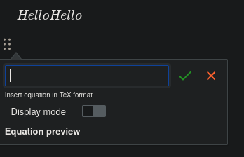

# ckeditor5-math
<figure class="image image-style-align-right"><figcaption><code>ckeditor5-math</code> in action.</figcaption></figure>

A fork of [isaul32/ckeditor5-math](https://github.com/isaul32/ckeditor5-math), which is the CKEditor5 plugin which adds the math functionality. We keep our own version to be able to use it on the latest version of CKEditor, alongside some custom improvements.

## Development environment

*   Tested on Node.js 20.
*   The package manager is yarn 1 (v1.22.22 is known to be working fine for it at the time of writing).

Important commands:

*   To check if the code has any formatting issues: `yarn lint`
*   To start a live preview: `yarn start`
*   To run the tests: `yarn test`
    *   Note that this requires Chromium, on NixOS this can be achieved by running a `nix-shell -p chromium`, and running `CHROME_BIN=$(which chromium) yarn test` inside it.