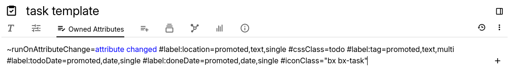

# Attributes
<figure class="image"></figure>

In Trilium, attributes are key-value pairs assigned to notes, providing additional metadata or functionality. There are two primary types of attributes:

1.  <a class="reference-link" href="Attributes/Labels.md">Labels</a> can be used for a variety of purposes, such as storing metadata or configuring the behavior of notes. Labels are also searchable, enhancing note retrieval.
    
    For more information, including predefined labels, see <a class="reference-link" href="Attributes/Labels.md">Labels</a>.
2.  <a class="reference-link" href="Attributes/Relations.md">Relations</a> define connections between notes, similar to links. These can be used for metadata and scripting purposes.
    
    For more information, including a list of predefined relations, see <a class="reference-link" href="Attributes/Relations.md">Relations</a>.

These attributes play a crucial role in organizing, categorizing, and enhancing the functionality of notes.

## Types of attributes

Conceptually there are two types of attributes (applying to both labels and relations):

1.  **System attributes**  
    As the name suggest, these attributes have a special meaning since they are interpreted by Trilium. For example the `color` attribute will change the color of the note as displayed in the <a class="reference-link" href="../Basic%20Concepts%20and%20Features/UI%20Elements/Note%20Tree.md">Note Tree</a> and links, and `iconClass` will change the icon of a note.
2.  **User-defined attributes**  
    These are free-form labels or relations that can be used by the user. They can be used purely for categorization purposes (especially if combined with <a class="reference-link" href="../Basic%20Concepts%20and%20Features/Navigation/Search.md">Search</a>), or they can be given meaning through the use of <a class="reference-link" href="../Scripting.md">Scripting</a>.

In practice, Trilium makes no direct distinction of whether an attribute is a system one or a user-defined one. A label or relation is considered a system attribute if it matches one of the built-in names (e.g. like the aforementioned `iconClass`). Keep this in mind when creating  <a class="reference-link" href="Attributes/Promoted%20Attributes.md">Promoted Attributes</a> in order not to accidentally alter a system attribute (unless intended).

## Viewing the list of attributes

Both the labels and relations for the current note are displayed in the _Owned Attributes_ section of the <a class="reference-link" href="../Basic%20Concepts%20and%20Features/UI%20Elements/Ribbon.md">Ribbon</a>, where they can be viewed and edited. Inherited attributes are displayed in the _Inherited Attributes_ section of the ribbon, where they can only be viewed.

In the list of attributes, labels are prefixed with the `#` character whereas relations are prefixed with the `~` character.

## Attribute Definitions and Promoted Attributes

<a class="reference-link" href="Attributes/Promoted%20Attributes.md">Promoted Attributes</a> create a form-like editing experience for attributes, which makes it easy to enhancing the organization and management of attributes

## Multiplicity

Attributes in Trilium can be "multi-valued", meaning multiple attributes with the same name can co-exist. This can be combined with <a class="reference-link" href="Attributes/Promoted%20Attributes.md">Promoted Attributes</a> to easily add them.

## Attribute Inheritance

Trilium supports attribute inheritance, allowing child notes to inherit attributes from their parents. For more information, see <a class="reference-link" href="Attributes/Attribute%20Inheritance.md">Attribute Inheritance</a>.