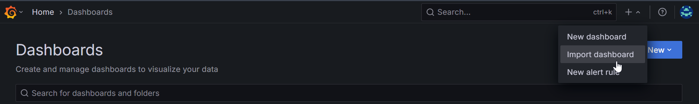

# Metrics
The Trilium Metrics API provides comprehensive monitoring data about your Trilium instance, designed for external monitoring systems like Prometheus.

## **Endpoint**

*   **URL**: `/etapi/metrics`
*   **Method**: `GET`
*   **Authentication**: ETAPI token required
*   **Default Format**: Prometheus text format

## **Authentication**

You need an ETAPI token to access the metrics endpoint. Get one by:

```
# Get an ETAPI token
curl -X POST http://localhost:8080/etapi/auth/login \
  -H "Content-Type: application/json" \
  -d '{"password": "your_password"}'

```

## **Usage**

### **Prometheus Format (Default)**

```
curl -H "Authorization: YOUR_ETAPI_TOKEN" \
  http://localhost:8080/etapi/metrics

```

Returns metrics in Prometheus text format:

```
# HELP trilium_info Trilium instance information
# TYPE trilium_info gauge
trilium_info{version="0.91.6",db_version="231",node_version="v18.17.0"} 1 1701432000

# HELP trilium_notes_total Total number of notes including deleted
# TYPE trilium_notes_total gauge
trilium_notes_total 1234 1701432000

```

### **JSON Format**

```
curl -H "Authorization: YOUR_ETAPI_TOKEN" \
  "http://localhost:8080/etapi/metrics?format=json"

```

Returns detailed metrics in JSON format for debugging or custom integrations.

## **Available Metrics**

### **Instance Information**

*   `trilium_info` - Version and build information with labels

### **Database Metrics**

*   `trilium_notes_total` - Total notes (including deleted)
*   `trilium_notes_deleted` - Number of deleted notes
*   `trilium_notes_active` - Number of active notes
*   `trilium_notes_protected` - Number of protected notes
*   `trilium_attachments_total` - Total attachments
*   `trilium_attachments_active` - Active attachments
*   `trilium_revisions_total` - Total note revisions
*   `trilium_branches_total` - Active branches
*   `trilium_attributes_total` - Active attributes
*   `trilium_blobs_total` - Total blob records
*   `trilium_etapi_tokens_total` - Active ETAPI tokens
*   `trilium_embeddings_total` - Note embeddings (if available)

### **Categorized Metrics**

*   `trilium_notes_by_type{type="text|code|image|file"}` - Notes by type
*   `trilium_attachments_by_type{mime_type="..."}` - Attachments by MIME type

### **Statistics**

*   `trilium_database_size_bytes` - Database size in bytes
*   `trilium_oldest_note_timestamp` - Timestamp of oldest note
*   `trilium_newest_note_timestamp` - Timestamp of newest note
*   `trilium_last_modified_timestamp` - Last modification timestamp

## **Prometheus Configuration**

Add to your `prometheus.yml`:

```
scrape_configs:
  - job_name: 'trilium'
    static_configs:
      - targets: ['localhost:8080']
    metrics_path: '/etapi/metrics'
    bearer_token: 'YOUR_ETAPI_TOKEN'
    scrape_interval: 30s

```

## **Error Responses**

*   `400` - Invalid format parameter
*   `401` - Missing or invalid ETAPI token
*   `500` - Internal server error

## **Grafana Dashboard**

<figure class="image"></figure>

You can also use the Grafana Dashboard that has been created for TriliumNext - just take the JSON from <a class="reference-link" href="Metrics/grafana-dashboard.json">grafana-dashboard.json</a> and then import the dashboard, following these screenshots:

<figure class="image"></figure>

Then paste the JSON, and hit load:

<figure class="image"></figure>