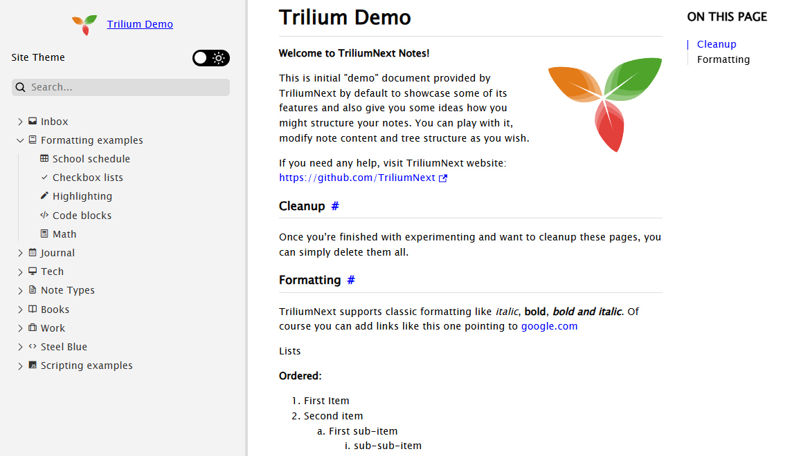
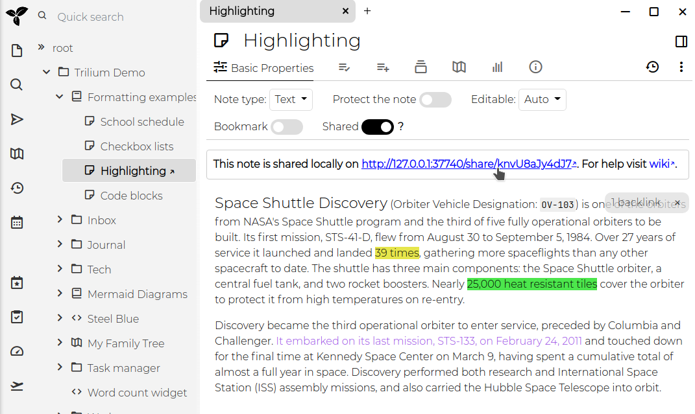

# Sharing
Trilium allows you to share selected notes as **publicly accessible** read-only documents. This feature is particularly useful for publishing content directly from your Trilium notes, making it accessible to others online.

<figure class="image"></figure>

## Features, interaction and limitations

*   Searching by note title.
*   Automatic dark/light mode based on the user's browser settings.
*   Mobile-friendly layout, with sidebar.
*   Collapsible tree with the same note icons as the application.
*   Customizable logo.
*   Toggle button for dark/light mode, which also stores the user preferences.
*   Quick navigation buttons (previous and next note).
*   Displaying the date of the last update of the note.

### By note type

<table class="ck-table-resized"><colgroup><col style="width:19.92%;"><col style="width:41.66%;"><col style="width:38.42%;"></colgroup><thead><tr><th>&nbsp;</th><th>Supported features</th><th>Limitations</th></tr></thead><tbody><tr><th><a class="reference-link" href="../Note%20Types/Text.md">Text</a></th><td><ul><li data-list-item-id="e26b4ce9ba4e9dfe224d04e0f341925ed">Table of contents.</li><li data-list-item-id="e9707fdfa2c92d66690cf932f7e647253">Syntax highlight of code blocks, provided a language is selected (does not work if “Auto-detected” is enabled).</li><li data-list-item-id="e84420a10c6d64bd107edb6e867c91d4b">Rendering for math equations.</li><li data-list-item-id="e10834dcd0619d77ae2e94d3695bedf58"><a href="../Note%20Types/Text/Include%20Note.md">Including notes</a> (only if the included notes are also shared).</li></ul></td><td><ul><li data-list-item-id="e41cc4139377f9f88d653d1eb8ca47bb4">Inline Mermaid diagrams are not rendered.</li></ul></td></tr><tr><th><a class="reference-link" href="../Note%20Types/Code.md">Code</a></th><td><ul><li data-list-item-id="e291ae6d5130677b4c99f7c3bdbe974b4">Basic support (displaying the contents of the note in a monospace font).</li></ul></td><td><ul><li data-list-item-id="e0270680bbdd7a129306e61e11691e36d">No syntax highlight.</li></ul></td></tr><tr><th><a class="reference-link" href="../Note%20Types/Saved%20Search.md">Saved Search</a></th><td>Not supported.</td><td>&nbsp;</td></tr><tr><th><a class="reference-link" href="../Note%20Types/Relation%20Map.md">Relation Map</a></th><td>Not supported.</td><td>&nbsp;</td></tr><tr><th><a class="reference-link" href="../Note%20Types/Note%20Map.md">Note Map</a></th><td>Not supported.</td><td>&nbsp;</td></tr><tr><th><a class="reference-link" href="../Note%20Types/Render%20Note.md">Render Note</a></th><td>Not supported.</td><td>&nbsp;</td></tr><tr><th><a class="reference-link" href="../Collections.md">Collections</a></th><td><ul><li data-list-item-id="ea031e1d4149eb443ace756234490c5a4">The child notes are displayed in a fixed format.&nbsp;</li></ul></td><td><ul><li data-list-item-id="ea4a9d424aec2afbaecc07bbf64b7bebd">More advanced view types such as the calendar view are not supported.</li></ul></td></tr><tr><th><a class="reference-link" href="../Note%20Types/Mermaid%20Diagrams.md">Mermaid Diagrams</a></th><td><ul><li data-list-item-id="e582d283f2b1b30cbe5ae35d8e01b2bf2">The diagram is displayed as a vector image.</li></ul></td><td><ul><li data-list-item-id="e33268686446e3c217077201bb5964364">No further interaction supported.</li></ul></td></tr><tr><th><a class="reference-link" href="../Note%20Types/Canvas.md">Canvas</a></th><td><ul><li data-list-item-id="e443dd0e97c30cb12c77e8906a71569ea">The diagram is displayed as a vector image.</li></ul></td><td><ul><li data-list-item-id="efe151ef3f3826c825416417525fb5fb2">No further interaction supported.</li></ul></td></tr><tr><th><a class="reference-link" href="../Note%20Types/Web%20View.md">Web View</a></th><td>Not supported.</td><td>&nbsp;</td></tr><tr><th><a class="reference-link" href="../Note%20Types/Mind%20Map.md">Mind Map</a></th><td>The diagram is displayed as a vector image.</td><td><ul><li data-list-item-id="ed3b4fb473042f6e32b4502d4fa11a767">No further interaction supported.</li></ul></td></tr><tr><th><a class="reference-link" href="../Collections/Geo%20Map.md">Geo Map</a></th><td>Not supported.</td><td>&nbsp;</td></tr><tr><th><a class="reference-link" href="../Note%20Types/File.md">File</a></th><td>Basic interaction (downloading the file).</td><td><ul><li data-list-item-id="ed87e836a39d127ebcbb33e9e59045afb">No further interaction supported.</li></ul></td></tr></tbody></table>

While the sharing feature is powerful, it has some limitations:

*   **Code Notes**: No syntax highlighting.
*   **Static Note Tree**
*   **Protected Notes**: Cannot be shared.
*   **Include Notes**: Not supported.

Some of these limitations may be addressed in future updates.

## Prerequisites

To use the sharing feature, you must have a <a class="reference-link" href="../Installation%20%26%20Setup/Server%20Installation.md">Server Installation</a> of Trilium. This is necessary because the notes will be hosted from the server.

## Sharing a note

1.  **Enable Sharing**: To share a note, toggle the `Shared` switch within the note's interface. Once sharing is enabled, an URL will appear, which you can click to access the shared note.
    
    
2.  **Access the Shared Note**: The link provided will open the note in your browser. If your server is not configured with a public IP, the URL will refer to `localhost (127.0.0.1)`.

## Sharing a note subtree

When you share a note, you actually share the entire subtree of notes beneath it. If the note has child notes, they will also be included in the shared content. For example, sharing the "Formatting" subtree will display a page with basic navigation for exploring all the notes within that subtree.

## Viewing and managing shared notes

You can view a list of all shared notes by clicking on "Show Shared Notes Subtree" in the <a class="reference-link" href="../Basic%20Concepts%20and%20Features/UI%20Elements/Global%20menu.md">Global menu</a>. This allows you to manage and navigate through all the notes you have made public.

## Security considerations

*   Shared notes are published on the open internet and can be accessed by anyone with the URL unless the notes are password-protected.
*   The URL's randomness does not provide security, so it is crucial not to share sensitive information through this feature.
*   Trilium takes precautions to protect your publicly shared instance from leaking information for non-shared notes, including opening a separate read-only connection to the <a class="reference-link" href="Database.md">Database</a>. Depending on your threat model, it might make more sense to use <a class="reference-link" href="Sharing/Exporting%20static%20HTML%20for%20web%20.md">Exporting HTML for web publishing</a> and use battle-tested web servers such as Nginx or Apache to serve static content.

### Password protection

To protect shared notes with a username and password, you can use the `#shareCredentials` attribute. Add this label to the note with the format `#shareCredentials="username:password"`. To protect an entire subtree, make sure the label is [inheritable](Attributes/Attribute%20Inheritance.md).

## Advanced sharing options

### Customizing the appearance of shared notes

The default design should be a good starting point, but you can customize it using your own CSS:

*   **Custom CSS**: Link a CSS <a class="reference-link" href="../Note%20Types/Code.md">Code</a> note to the shared page by adding a `~shareCss` relation to the note. If you want this style to apply to the entire subtree, make the label inheritable. You can hide the CSS code note from the tree navigation by adding the `#shareHiddenFromTree` label.
*   **Omitting Default CSS**: For extensive styling changes, use the `#shareOmitDefaultCss` label to avoid conflicts with Trilium's [default stylesheet](../Basic%20Concepts%20and%20Features/Themes.md).

### Adding JavaScript

You can inject custom JavaScript into the shared note using the `~shareJs` relation. This allows you to access note attributes or traverse the note tree using the `fetchNote()` API, which retrieves note data based on its ID.

### Adding custom HTML

You can inject custom HTML snippets into specific locations of the shared page using the `~shareHtml` relation. The HTML note should contain the raw HTML content you want to inject, and you can control where it appears by adding the `#shareHtmlLocation` label to the HTML snippet note itself.

The `#shareHtmlLocation` label accepts values in the format `location:position`:

*   **Locations**: `head`, `body`, `content`
*   **Positions**: `start`, `end`

For example:

*   `#shareHtmlLocation=head:start` - Injects HTML at the beginning of the `<head>` section
*   `#shareHtmlLocation=head:end` - Injects HTML at the end of the `<head>` section (default)
*   `#shareHtmlLocation=body:start` - Injects HTML at the beginning of the `<body>` section
*   `#shareHtmlLocation=content:start` - Injects HTML at the beginning of the content area
*   `#shareHtmlLocation=content:end` - Injects HTML at the end of the content area

If no location is specified, the HTML will be injected at `content:end` by default.

Example:

```javascript
const currentNote = await fetchNote();
const parentNote = await fetchNote(currentNote.parentNoteIds[0]);

for (const attr of parentNote.attributes) {
    console.log(attr.type, attr.name, attr.value);
}
```

### Creating human-readable URL aliases

Shared notes typically have URLs like `http://domain.tld/share/knvU8aJy4dJ7`, where the last part is the note's ID. You can make these URLs more user-friendly by adding the `#shareAlias` label to individual notes (e.g., `#shareAlias=highlighting`). This will change the URL to `http://domain.tld/share/highlighting`.

**Important**:

1.  Ensure that aliases are unique.
2.  Using slashes (`/`) within aliases to create subpaths is not supported.

> [!TIP]
> *   To easily identify pages that don't have a share alias, run a <a class="reference-link" href="../Basic%20Concepts%20and%20Features/Navigation/Search.md">Search</a> with `#!shareAlias`.
> *   To be able to enter the share alias faster, consider using <a class="reference-link" href="Attributes/Promoted%20Attributes.md">Promoted Attributes</a> (for example `#label:shareAlias(inheritable)="promoted,alias=Slug,single,text"`).

### Setting a custom favicon

To customize the favicon for your shared pages, create a relation `~shareFavicon` pointing to a file note containing the favicon (e.g., in `.ico` format).

### Sharing a note as the root

You can designate a specific note or folder as the root of your shared content by adding the `#shareRoot` label. This note will be linked when visiting `[http://domain.tld/share](http://domain/share)`, making it easier to use Trilium as a fully-fledged website.

> [!TIP]
> Consider combining this with the `#shareIndex` label, which will display a list of all shared notes.

### Displaying an index of shared notes

When accessing a share, the sub-notes will be displayed in a tree on the left. But since multiple note trees can be shared, it might be useful to display a list of all the different share trees.

To do so, create a shared text note and apply the `shareIndex` label. When viewed, the list of shared roots will be displayed at the bottom of the note.

## Attribute reference

<table class="ck-table-resized"><colgroup><col style="width:18.38%;"><col style="width:81.62%;"></colgroup><thead><tr><th>Attribute</th><th>Description</th></tr></thead><tbody><tr><td><code>#shareHiddenFromTree</code></td><td>this note is hidden from left navigation tree, but still accessible with its URL</td></tr><tr><td><code>#shareExternalLink</code></td><td>note will act as a link to an external website in the share tree</td></tr><tr><td><code>#shareAlias</code></td><td>define an alias using which the note will be available under <code>https://your_trilium_host/share/[your_alias]</code></td></tr><tr><td><code>#shareOmitDefaultCss</code></td><td>default share page CSS will be omitted. Use when you make extensive styling changes.</td></tr><tr><td><code>#shareRoot</code></td><td>marks note which is served on /share root.</td></tr><tr><td><code>#shareDescription</code></td><td>define text to be added to the HTML meta tag for description</td></tr><tr><td><code>#shareRaw</code></td><td>Note will be served in its raw format, without HTML wrapper. See also&nbsp;<a class="reference-link" href="Sharing/Serving%20directly%20the%20content%20o.md">Serving directly the content of a note</a>&nbsp;for an alternative method without setting an attribute.</td></tr><tr><td><code>#shareDisallowRobotIndexing</code></td><td><p>Indicates to web crawlers that the page should not be indexed of this note by:</p><ul><li data-list-item-id="e6baa9f60bf59d085fd31aa2cce07a0e7">Setting the <code>X-Robots-Tag: noindex</code> HTTP header.</li><li data-list-item-id="ec0d067db136ef9794e4f1033405880b7">Setting the <code>noindex, follow</code> meta tag.</li></ul></td></tr><tr><td><code>#shareCredentials</code></td><td>require credentials to access this shared note. Value is expected to be in format <code>username:password</code>. Don't forget to make this inheritable to apply to child-notes/images.</td></tr><tr><td><code>#shareIndex</code></td><td>Note with this label will list all roots of shared notes.</td></tr><tr><td><code>#shareHtmlLocation</code></td><td>defines where custom HTML injected via <code>~shareHtml</code> relation should be placed. Applied to the HTML snippet note itself. Format: <code>location:position</code> where location is <code>head</code>, <code>body</code>, or <code>content</code> and position is <code>start</code> or <code>end</code>. Defaults to <code>content:end</code>.</td></tr></tbody></table>

### Customizing logo

It's possible to adjust the logo which is displayed on the top-left of the left pane.

| Attribute | Description |
| --- | --- |
| `~shareLogo` | Relation set to an image to use as logo. The image must be part of the share tree (it can be hidden if needed). |
| `#shareLogoWidth` | The width (in pixels, without unit) to set for the logo. Default is `53`. |
| `#shareLogoHeight` | The height (in pixels, without unit) to set for the logo. Default is `40`. |
| `#shareRootLink` | URL to navigate to when the logo is pressed. |

### Customizing OpenGraph

| Attribute | Description |
| --- | --- |
| `#shareOpenGraphColor` | This adjusts the `theme-color` meta-property. |
| `#shareOpenGraphURL` | This adjusts the `og:url` and `twitter:url` meta-properties. |
| `#shareOpenGraphDomain` | Adjusts the `twitter:domain` meta-property. |
| `#shareOpenGraphImage`  <br>`~shareOpenGraphImage` | Can be either a label, case in which the value is passed on as-is, or it can be a relation to an image <a class="reference-link" href="../Note%20Types/File.md">File</a>. This controls the `og:image` meta-property. |

## Credits

Since v0.95.0, a new theme was introduced (and enabled by default) which greatly improves the visual aspect of the Share feature, as well as its functionality (such as mobile support, dark/light mode, collapsible tree, etc.). This theme is an adaptation of the [Trilium Rocks!](https://github.com/zerebos/trilium.rocks) by [zerebos](https://github.com/zerebos).