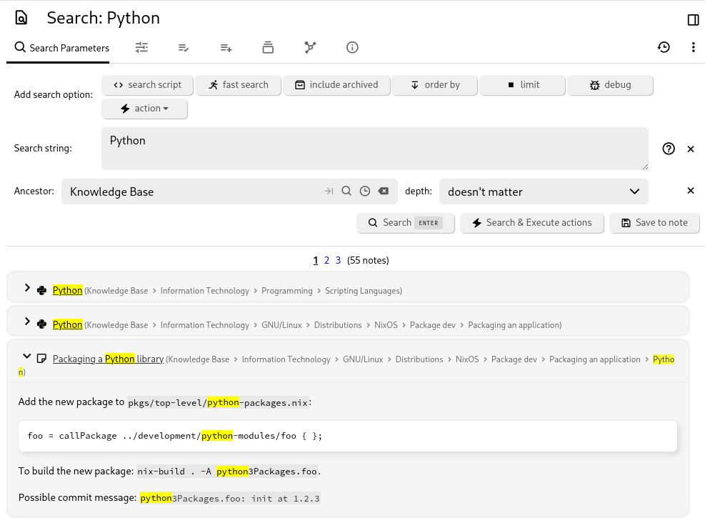

# Search
<figure class="image"></figure>

Note search enables you to find notes by searching for text in the title, content, or [attributes](../../Advanced%20Usage/Attributes.md) of the notes. You also have the option to save your searches, which will create a special search note which is visible on your navigation tree and contains the search results as sub-items.

## Accessing the search

*   From the <a class="reference-link" href="../UI%20Elements/Launch%20Bar.md">Launch Bar</a>, look for the dedicated search button.
*   To limit the search to a note and its children, select _Search from subtree_ from the <a class="reference-link" href="../UI%20Elements/Note%20Tree/Note%20tree%20contextual%20menu.md">Note tree contextual menu</a> or press <kbd>Ctrl</kbd>+<kbd>Shift</kbd>+<kbd>S</kbd>.

## Interaction

To search for notes, click on the magnifying glass icon on the toolbar or press the keyboard [shortcut](../Keyboard%20Shortcuts.md).

1.  Set the text to search for in the _Search string_ field.
    1.  Apart from searching for words literally, there is also the possibility to search for attributes or properties of notes.
    2.  See the examples below for more information.
2.  To limit the search to a note and its sub-children, set a note in _Ancestor_.
    1.  This value is also pre-filled if the search is triggered from a [hoisted note](Note%20Hoisting.md) or a [workspace](Workspaces.md).
    2.  To search the entire database, keep the value empty.
3.  To limit the search to only a few levels of hierarchy (e.g. look in sub-children but not in sub-sub-children of a note), set the _depth_ field to one of the provided values.
4.  In addition to that, the search can be configured via the _Add search options_ buttons, as described in the follow-up section.
5.  Press _Search_ to trigger the search. The results are displayed below the search configuration pane.
6.  The _Search & Execute actions_ button is only relevant if at least one action has been added (as described in the section below).
7.  The _Save to note_ will create a new note with the search configuration. For more information, see <a class="reference-link" href="../../Note%20Types/Saved%20Search.md">Saved Search</a>.

## Search options

Click on which search option to apply from the Add search option section.

*   For each search option selected, the search configuration will update to reveal the entry. Each search option will have its own configuration.
*   To remove a search option, simply press the X button to the right of it.

The options available are:

1.  Search script
    1.  This feature allows writing a <a class="reference-link" href="../../Note%20Types/Code.md">Code</a> note that will handle the search on its own.
2.  Fast search
    1.  The search will not look into the content of the notes, but it will still look into note titles and attributes, relations (based on the search query).
    2.  This method can speed up the search considerably for large [databases](../../Advanced%20Usage/Database.md).
3.  Include archived
    1.  <a class="reference-link" href="../Notes/Archived%20Notes.md">Archived Notes</a> will also be included in the results, whereas otherwise they would be ignored.
4.  Order by
    1.  Allows changing the criteria for ordering the results, for example to order by creation date or alphabetically instead of by relevancy (default).
    2.  It's also possible to change the order (ascending or descending) of the results.
5.  Limit
    1.  Limits the results to a given maximum.
    2.  This can help if the number of results would otherwise be high, at the cost of not being able to view all the results.
6.  Debug
    1.  This will print additional information in the server log (see <a class="reference-link" href="../../Troubleshooting/Error%20logs.md">Error logs</a>), regarding how the search expression was parsed.
    2.  This function is especially useful after understanding the search functionality in detail, in order to determine why a complex search query is not working as expected.
7.  Action
    1.  Apart from just searching, it is also possible to apply actions such as to add a label or a relation to the notes that have been matched by the search.
    2.  Unlike other search configurations, here it's possible to apply the same action multiple times (i.e. in order to be able to apply multiple labels to notes).
    3.  The actions given are the same as the ones in <a class="reference-link" href="../../Advanced%20Usage/Bulk%20Actions.md">Bulk Actions</a>, which is an alternative for operating directly with notes within the <a class="reference-link" href="../UI%20Elements/Note%20Tree.md">Note Tree</a>.
    4.  After defining the actions, first press _Search_ to check the matched notes and then press _Search & Execute actions_ to trigger the actions.

### Simple Note Search Examples

*   `rings tolkien`: Full-text search to find notes containing both "rings" and "tolkien".
*   `"The Lord of the Rings" Tolkien`: Full-text search where "The Lord of the Rings" must match exactly.
*   `note.content *=* rings OR note.content *=* tolkien`: Find notes containing "rings" or "tolkien" in their content.
*   `towers #book`: Combine full-text and attribute search to find notes containing "towers" and having the "book" label.
*   `towers #book or #author`: Search for notes containing "towers" and having either the "book" or "author" label.
*   `towers #!book`: Search for notes containing "towers" and not having the "book" label.
*   `#book #publicationYear = 1954`: Find notes with the "book" label and "publicationYear" set to 1954.
*   `#genre *=* fan`: Find notes with the "genre" label containing the substring "fan". Additional operators include `*=*` for "contains", `=*` for "starts with", `*=` for "ends with", and `!=` for "is not equal to".
*   `#book #publicationYear >= 1950 #publicationYear < 1960`: Use numeric operators to find all books published in the 1950s.
*   `#dateNote >= TODAY-30`: Find notes with the "dateNote" label within the last 30 days. Supported date values include NOW +- seconds, TODAY +- days, MONTH +- months, YEAR +- years.
*   `~author.title *=* Tolkien`: Find notes related to an author whose title contains "Tolkien".
*   `#publicationYear %= '19[0-9]{2}'`: Use the '%=' operator to match a regular expression (regex). This feature has been available since Trilium 0.52.
*   `note.content %= '\\d{2}:\\d{2} (PM|AM)'`: Find notes that mention a time. Backslashes in a regex must be escaped.

### Fuzzy Search

Trilium supports fuzzy search operators that find results with typos or spelling variations:

*   `#title ~= trilim`: Fuzzy exact match - finds notes with titles like "Trilium" even if you typed "trilim" (with typo)
*   `#content ~* progra`: Fuzzy contains match - finds notes containing words like "program", "programmer", "programming" even with slight misspellings
*   `note.content ~* develpment`: Will find notes containing "development" despite the typo

**Important notes about fuzzy search:**

*   Fuzzy search requires at least 3 characters in the search term
*   Maximum edit distance is 2 characters (number of character changes needed)
*   Diacritics are normalized (e.g., "café" matches "cafe")
*   Fuzzy matches work best for finding content with minor typos or spelling variations

### Advanced Use Cases

*   `~author.relations.son.title = 'Christopher Tolkien'`: Search for notes with an "author" relation to a note that has a "son" relation to "Christopher Tolkien". This can be modeled with the following note structure:
    *   Books
        *   Lord of the Rings
            *   label: “book”
            *   relation: “author” points to “J. R. R. Tolkien” note
    *   People
        *   J. R. R. Tolkien
            *   relation: “son” points to "Christopher Tolkien" note
            *   Christopher Tolkien
*   `~author.title *= Tolkien OR (#publicationDate >= 1954 AND #publicationDate <= 1960)`: Use boolean expressions and parentheses to group expressions. Note that expressions starting with a parenthesis need an "expression separator sign" (# or ~) prepended.
*   `note.parents.title = 'Books'`: Find notes with a parent named "Books".
*   `note.parents.parents.title = 'Books'`: Find notes with a grandparent named "Books".
*   `note.ancestors.title = 'Books'`: Find notes with an ancestor named "Books".
*   `note.children.title = 'sub-note'`: Find notes with a child named "sub-note".

### Search with Note Properties

Notes have properties that can be used in searches, such as `noteId`, `dateModified`, `dateCreated`, `isProtected`, `type`, `title`, `text`, `content`, `rawContent`, `ownedLabelCount`, `labelCount`, `ownedRelationCount`, `relationCount`, `ownedRelationCountIncludingLinks`, `relationCountIncludingLinks`, `ownedAttributeCount`, `attributeCount`, `targetRelationCount`, `targetRelationCountIncludingLinks`, `parentCount`, `childrenCount`, `isArchived`, `contentSize`, `noteSize`, and `revisionCount`.

These properties can be accessed via the `note.` prefix, e.g., `note.type = code AND note.mime = 'application/json'`.

### Order by and Limit

```
#author=Tolkien orderBy #publicationDate desc, note.title limit 10
```

This example will:

1.  Find notes with the author label "Tolkien".
2.  Order the results by `publicationDate` in descending order.
3.  Use `note.title` as a secondary ordering if publication dates are equal.
4.  Limit the results to the first 10 notes.

### Negation

Some queries can only be expressed with negation:

```
#book AND not(note.ancestor.title = 'Tolkien')
```

This query finds all book notes not in the "Tolkien" subtree.

## Progressive Search Strategy

Trilium uses a progressive search strategy that performs exact matching first, then adds fuzzy matching when needed.

### How Progressive Search Works

1.  **Phase 1 - Exact Matching**: When you search, Trilium first looks for exact matches of your search terms. This handles the vast majority of searches (90%+) and returns results almost instantly.
2.  **Phase 2 - Fuzzy Fallback**: If Phase 1 doesn't find enough high-quality results (fewer than 5 results with good relevance scores), Trilium automatically adds fuzzy matching to find results with typos or spelling variations.
3.  **Result Ordering**: Exact matches always appear before fuzzy matches, regardless of individual scores. This ensures that when you search for "project", notes containing the exact word "project" will appear before notes containing similar words like "projects" or "projection".

### Progressive Search Behavior

*   **Speed**: Most searches complete using only exact matching
*   **Ordering**: Exact matches appear before fuzzy matches
*   **Fallback**: Fuzzy matching activates when exact matches return fewer than 5 results
*   **Identification**: Results indicate whether they are exact or fuzzy matches

### Search Performance

Search system specifications:

*   Content size limit: 10MB per note (previously 50KB)
*   Edit distance calculations for fuzzy matching
*   Infinite scrolling in Quick Search

## Under the Hood

### Label and Relation Shortcuts

The "full" syntax for searching by labels is:

```
note.labels.publicationYear = 1954
```

For relations:

```
note.relations.author.title *=* Tolkien
```

However, common label and relation searches have shortcut syntax:

```
#publicationYear = 1954
#author.title *=* Tolkien
```

### Separating Full-Text and Attribute Parts

Search syntax allows combining full-text search with attribute-based search. For example, `tolkien #book` contains:

1.  Full-text tokens - `tolkien`
2.  Attribute expressions - `#book`

Trilium detects the separation between full text search and attribute/property search by looking for certain special characters or words that denote attributes and properties (e.g., #, ~, note.). If you need to include these in full-text search, escape them with a backslash so they are processed as regular text:

```
"note.txt" 
\#hash 
#myLabel = 'Say "Hello World"'
```

### Escaping Special Characters

Special characters can be enclosed in quotes or escaped with a backslash to be used in full-text search:

```
"note.txt"
\#hash
#myLabel = 'Say "Hello World"'
```

Three types of quotes are supported: single, double, and backtick.

### Type Coercion

Label values are technically strings but can be coerced for numeric comparisons:

```
note.dateCreated =* '2019-05'
```

This finds notes created in May 2019. Numeric operators like `#publicationYear >= 1960` convert string values to numbers for comparison.

## Auto-Trigger Search from URL

You can open Trilium and automatically trigger a search by including the search [url encoded](https://meyerweb.com/eric/tools/dencoder/) string in the URL:

`http://localhost:8080/#?searchString=abc`

## Search Configuration

### Parameters

| Parameter | Value | Description |
| --- | --- | --- |
| MIN\_FUZZY\_TOKEN\_LENGTH | 3 | Minimum characters for fuzzy matching |
| MAX\_EDIT\_DISTANCE | 2 | Maximum character changes allowed |
| RESULT\_SUFFICIENCY\_THRESHOLD | 5 | Minimum exact results before fuzzy fallback |
| MAX\_CONTENT\_SIZE | 10MB | Maximum note content size for search processing |

### Limits

*   Searched note content is limited to 10MB per note to prevent performance issues
*   Notes exceeding this limit will still be included in title and attribute searches
*   Fuzzy matching requires tokens of at least 3 characters