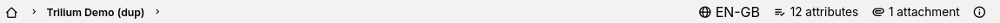

# Breadcrumb
<figure class="image"></figure>

The breadcrumb allows quickly viewing the note hierarchy of the current note and navigating through it.

It is part of the <a class="reference-link" href="Status%20bar.md">Status bar</a>, displayed in the bottom-left of the screen.

## Layout and Interaction

*   If a note or workspace is hoisted, a badge will appear on the left-most side.
    *   Clicking on the badge will un-hoist the note/workspace.
*   The left-most icon represents the root note, or the hoisted note or workspace.
    *   Clicking the icon will jump to the root note.
    *   Right clicking the icon will display a menu that allows opening the note in a new tab, split, etc.
*   Each segment shows the title of a note in the current note hierarchy.
    *   Clicking the icon will jump to that note.
    *   Right clicking will open a menu with multiple options such as opening the note in a different tab/split/window, hoisting, moving/cloning the note, duplicating as well as changing the color of the note.
*   Clicking the arrow next to each segment will reveal the child notes of the segment on the left.
    *   Clicking on an icon will navigate to that particular note.
    *   It's also possible to create a new child note from here.
    *   The menu can optionally hide the archived notes.
*   If the current note is deep within a hierarchy, the segments will collapse into a \[…\] button in order not to occupy too much space.
    *   Clicking this button will display each collapsed entry as a menu item. Clicking on it will navigate to that particular note.
*   Right clicking on an empty space to the right of the breadcrumb (before the other status bar items) will reveal another menu that allows:
    *   Toggling whether archived notes are displayed in the breadcrumb and in the note tree.
    *   Copying the current note path to clipboard.