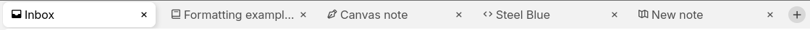

# Tabs
<figure class="image image-style-align-center"></figure>

In Trilium, tabs allow easy switching between notes.

## Layout

Depending on the <a class="reference-link" href="Vertical%20and%20horizontal%20layout.md">Vertical and horizontal layout</a>:

*   For the vertical layout, the tabs will be placed at the top but to the right of the <a class="reference-link" href="Note%20Tree.md">Note Tree</a>.
*   For the horizontal layout, the tabs will be placed at the top in full-width, above the [note tree](Note%20Tree.md), allowing for more tabs to be comfortably displayed.

## Interaction

*   To create a new tab, press the  button that is to the right of the last tab.
*   To close a tab, press the corresponding  button.
*   For multitasking, tabs can be used alongside <a class="reference-link" href="Split%20View.md">Split View</a>. Each tab can have one or more notes, displayed horizontally.
*   Tabs can be reordered by drag-and-dropping it into a new position.
*   An existing tab can be displayed in a new window by dragging the tab upwards or downwards. It is not possible to combine tabs back into another window.

## Keyboard interaction

Since tabs are a commonly used feature, there are multiple keyboard shortcuts that can be used:

*   <kbd>Ctrl</kbd>+<kbd>T</kbd> to open a new tab.
*   <kbd>Ctrl</kbd>+<kbd>W</kbd> to close the current tab.
*   <kbd>Ctrl</kbd>+<kbd>Shift</kbd>+<kbd>T</kbd> to reopen the last closed tab.
*   <kbd>Ctrl</kbd>+<kbd>Tab</kbd> and <kbd>Ctrl</kbd>+<kbd>Shift</kbd>+<kbd>Tab</kbd> to go to the next or previous tab.
*   <kbd>Ctrl</kbd>+<kbd>1</kbd>, <kbd>Ctrl</kbd>+<kbd>2</kbd>, up to <kbd>Ctrl</kbd>+<kbd>9</kbd> to activate the first, second and up to ninth tab.
*   There is also a shortcut to go to the last tab, but it is not assigned a key by default.

## Mobile

<figure class="image image-style-align-right image_resized" style="width:34.12%;"></figure>

Tabs are also supported on the <a class="reference-link" href="../../Installation%20%26%20Setup/Mobile%20Frontend.md">Mobile Frontend</a>.

Since v0.102.0, the tabs are displayed by pressing the dedicated tab switcher button in the <a class="reference-link" href="Launch%20Bar.md">Launch Bar</a>. In this view the tabs are laid out on a grid with a preview of the note content.

The context menu button at the top-right of the popup allows creating a new tab, reopening the last closed tab and closing all the tabs.

<a class="reference-link" href="Split%20View.md">Split View</a>s are also indicated in the tab switcher, with two titles displayed in a tab.

> [!NOTE]
> Versions prior to v0.102.0 also supported tabs, but they were displayed directly above the <a class="reference-link" href="Launch%20Bar.md">Launch Bar</a>. The decision to use a more mobile-like tab switcher was taken because the original tab bar could not support many tabs at once and the new design better aligns with how mobile applications handle tabs.