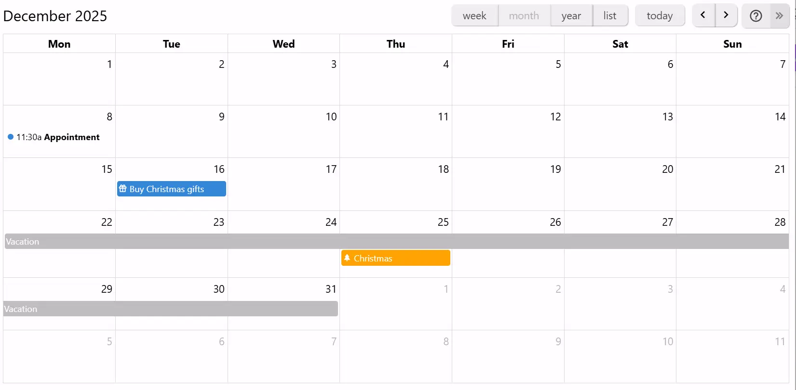
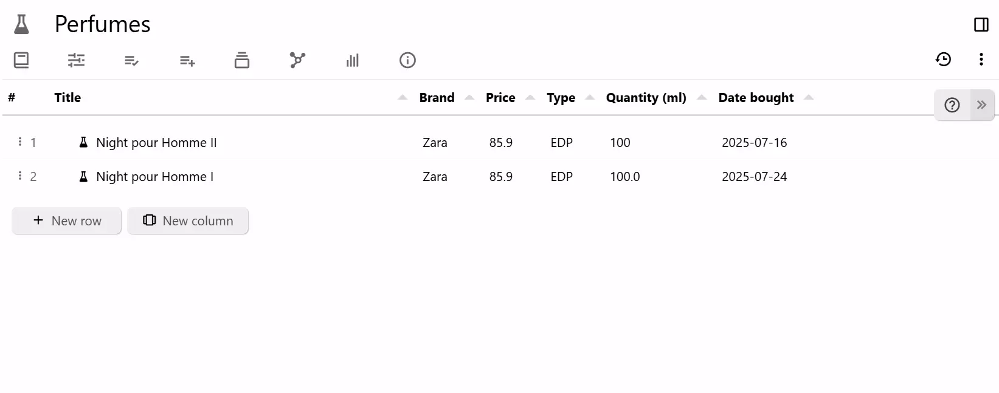
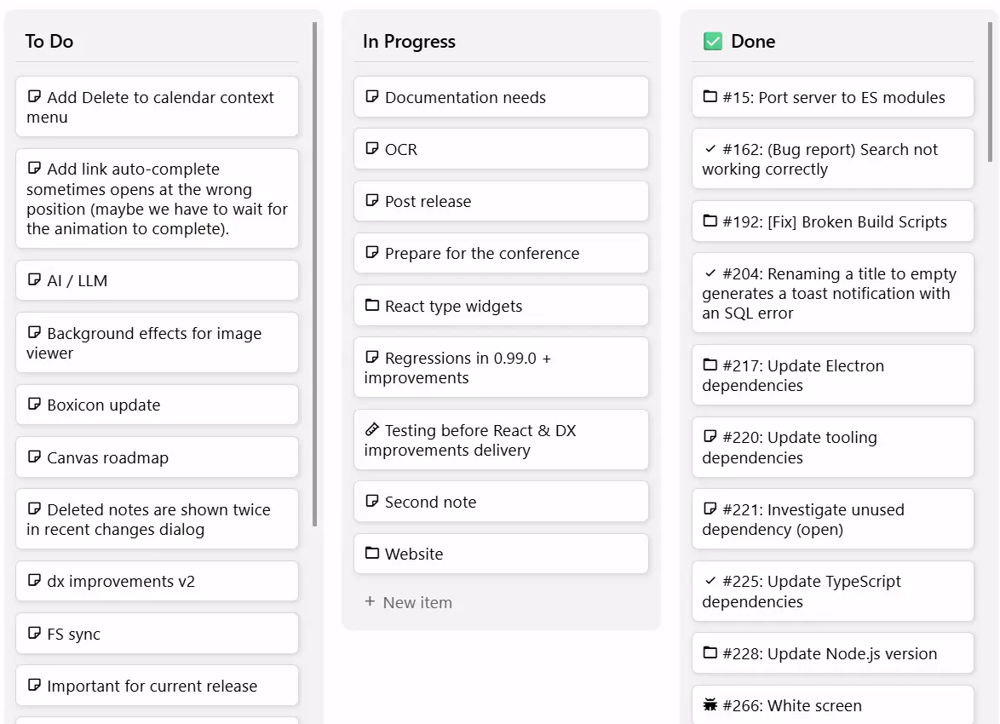
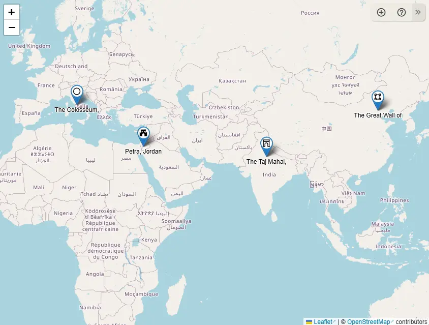
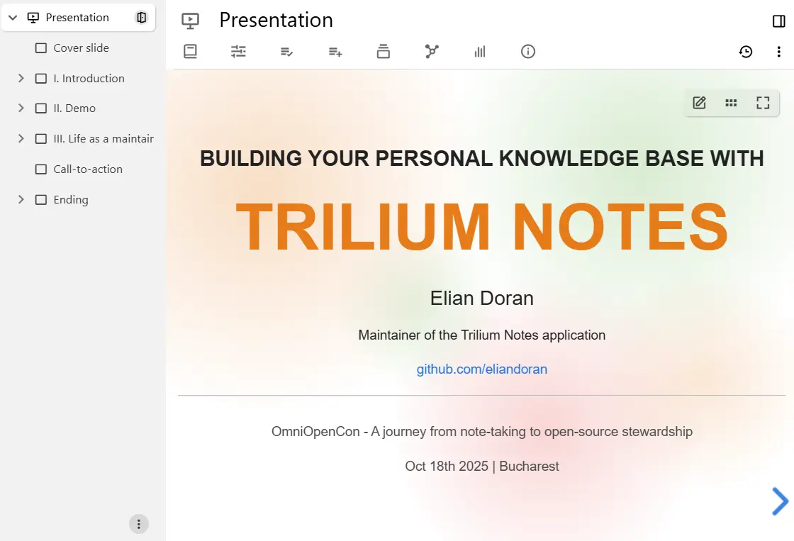

# Collections
Collections are a unique type of note that don't have content, but instead display their child notes in various presentation methods.

## Main collections

|  |  |
| --- | --- |
| <figure class="image"></figure> | <a class="reference-link" href="Collections/Calendar.md">Calendar</a>    which displays a week, month or year calendar with the notes being shown as events. New events can be added easily by dragging across the calendar. |
| <figure class="image"></figure> | <a class="reference-link" href="Collections/Table.md">Table</a>    displays each note as a row in a table, with <a class="reference-link" href="Advanced%20Usage/Attributes/Promoted%20Attributes.md">Promoted Attributes</a> being shown as well. This makes it easy to visualize attributes of notes, as well as making them easily editable. |
| <figure class="image"></figure> | <a class="reference-link" href="Collections/Kanban%20Board.md">Kanban Board</a>    displays notes in columns, grouped by the value of a label. Items and columns can easily be created or dragged around to change their status. |
| <figure class="image"></figure> | <a class="reference-link" href="Collections/Geo%20Map.md">Geo Map</a>    which displays a geographical map in which the notes are represented as markers/pins on the map. New events can be easily added by pointing on the map. |
| <figure class="image"></figure> | <a class="reference-link" href="Collections/Presentation.md">Presentation</a>    which shows each note as a slide and can be presented full-screen with smooth transitions or exported to PDF for sharing. |

## Classic collections

Classic collections are read-only mode and compiles the contents of all child notes into one continuous view. This makes it ideal for reading extensive information broken into smaller, manageable segments.

*   <a class="reference-link" href="Collections/Grid%20View.md">Grid View</a> which is the default presentation method for child notes (see <a class="reference-link" href="Basic%20Concepts%20and%20Features/Notes/Note%20List.md">Note List</a>), where the notes are displayed as tiles with their title and content being visible.
*   <a class="reference-link" href="Collections/List%20View.md">List View</a> is similar to <a class="reference-link" href="Collections/Grid%20View.md">Grid View</a>, but it displays the notes one under the other with the content being expandable/collapsible, but also works recursively.

## Creating a new collection

To create a new collections, right click in the <a class="reference-link" href="Basic%20Concepts%20and%20Features/UI%20Elements/Note%20Tree.md">Note Tree</a> and look for the _Collections_ entry and select the desired type.

By default, collections come with a default configuration and sometimes even sample notes. To create a collection completely from scratch:

1.  Create a new note of type _Text_ (or any type).
2.  Change the [note type](Note%20Types.md) to _Collection_.
3.  In <a class="reference-link" href="Collections/Collection%20Properties.md">Collection Properties</a>, select the desired view type.
4.  Consult the help page of the corresponding view type in order to understand how to configure them.

## Configuration

To change the configuration of a collection or even switch to a different collection (e.g. from Kanban Board to a Calendar), see the <a class="reference-link" href="Collections/Collection%20Properties.md">Collection Properties</a> bar at the top of the note.

## Archived notes

By default, [archived notes](Basic%20Concepts%20and%20Features/Notes/Archived%20Notes.md) will not be shown in collections. This behavior can be changed by going to <a class="reference-link" href="Collections/Collection%20Properties.md">Collection Properties</a> and checking _Show archived notes_.

Archived notes will be generally indicated by being greyed out as opposed to the normal ones.

## Hiding the child notes from the note tree

For collections with a large number of items, it can be helpful to hide the items from the note tree for performance reasons and to reduce clutter. This is especially useful for standalone collections, such as a geomap or a task board.

To do so, go to <a class="reference-link" href="Collections/Collection%20Properties.md">Collection Properties</a> and select _Hide child notes in tree_.

## Advanced use cases

### Adding a description to a collection

To add a text before the collection, for example to describe it:

1.  Create a new collection.
2.  Change the [note type](Note%20Types.md) from _Collection_ to _Text_.

Now the text will be displayed above while still maintaining the collection view.

The only downside to this method is that <a class="reference-link" href="Collections/Collection%20Properties.md">Collection Properties</a> will not be shown anymore. In this case, modify the attributes manually or switch back temporarily to the _Collection_ type for configuration purposes.

### Using saved search

Collections, by default, only display the child notes. However, it is possible to use the <a class="reference-link" href="Basic%20Concepts%20and%20Features/Navigation/Search.md">Search</a> functionality to display notes all across the tree, with advanced querying functionality.

To do so, simply start a <a class="reference-link" href="Basic%20Concepts%20and%20Features/Navigation/Search.md">Search</a> and go to the _Collection Properties_ tab in the <a class="reference-link" href="Basic%20Concepts%20and%20Features/UI%20Elements/Ribbon.md">Ribbon</a> and select a desired type of collection. To keep the search-based collection, use a <a class="reference-link" href="Note%20Types/Saved%20Search.md">Saved Search</a>.

> [!IMPORTANT]
> While in search, none of the collections will not display the child notes of the search results. The reason is that the search might hit a note multiple times, causing an exponential rise in the number of results.

## Under the hood

Collections by themselves are simply notes with no content that rely on the <a class="reference-link" href="Basic%20Concepts%20and%20Features/Notes/Note%20List.md">Note List</a> mechanism (the one that lists the children notes at the bottom of a note) to display information.

By default, new collections use predefined <a class="reference-link" href="Advanced%20Usage/Templates.md">Templates</a> that are stored safely in the <a class="reference-link" href="Advanced%20Usage/Hidden%20Notes.md">Hidden Notes</a> to define some basic configuration such as the type of view, but also some <a class="reference-link" href="Advanced%20Usage/Attributes/Promoted%20Attributes.md">Promoted Attributes</a> to make editing easier.

Collections don't store their configuration (e.g. the position on the map, the hidden columns in a table) in the content of the note itself, but as attachments.