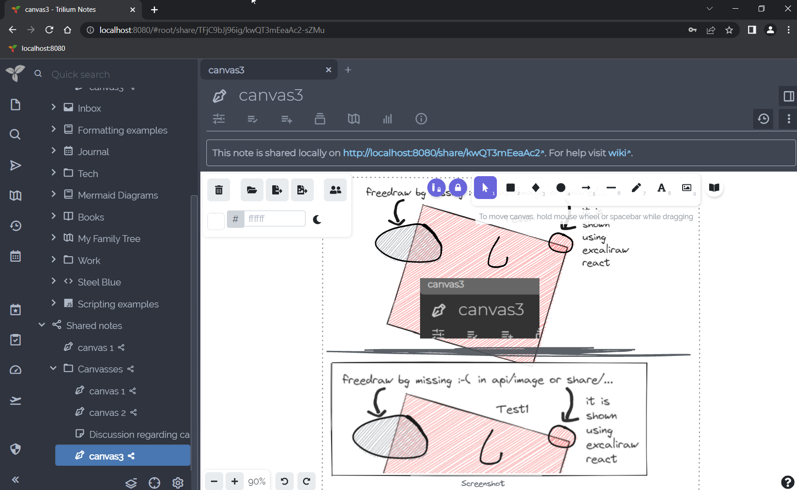

# Canvas
<figure class="image"></figure>

Available since Trilium v0.52.

Canvas notes use the Excalidraw library to allow handwritten notes with mouse, pen or touch on an infinite canvas. It also supports basic diagramming, text and graphics input.

## Interaction

*   The note can be togged [read-only](../Basic%20Concepts%20and%20Features/Notes/Read-Only%20Notes.md) from the <a class="reference-link" href="../Basic%20Concepts%20and%20Features/UI%20Elements/Floating%20buttons.md">Floating buttons</a> section.