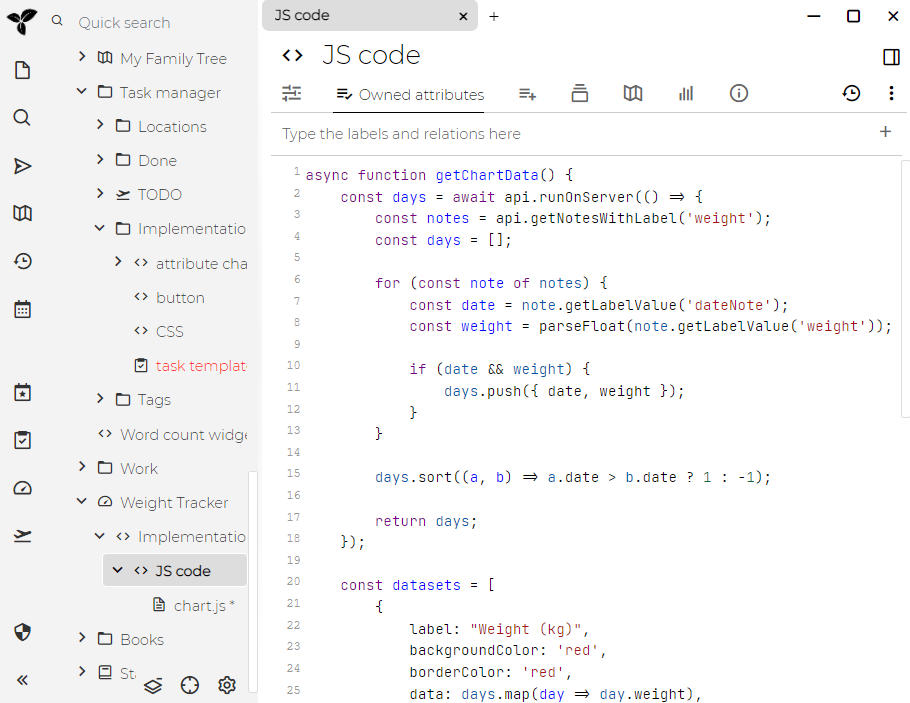
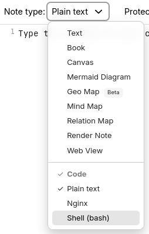

# Code
Trilium supports creating "code" notes, i.e. notes which contain some sort of formal code - be it programming language (C++, JavaScript), structured data (JSON, XML) or other types of codes (CSS etc.).

This can be useful for a few things:

*   computer programmers can store code snippets as notes with syntax highlighting
*   JavaScript code notes can be executed inside Trilium for some extra functionality
    *   we call such JavaScript code notes "scripts" - see <a class="reference-link" href="../Scripting.md">Scripting</a>
*   JSON, XML etc. can be used as storage for structured data (typically used in conjunction with scripting)

For shorter snippets of code that can be embedded in [Text](Text.md) notes, see [Code blocks](Text/Developer-specific%20formatting/Code%20blocks.md).

## Adjusting the language of a code note

In the [Ribbon](../Basic%20Concepts%20and%20Features/UI%20Elements/Ribbon.md), look for the _Note type_ selector and click it to reveal the possible note types. Inside of it there will be a section called _Code_, select any one of the languages.

## Adjusting the list of languages

Trilium supports syntax highlighting for many languages, but by default displays only some of them. The supported languages can be adjusted by going to [Options](../Basic%20Concepts%20and%20Features/UI%20Elements/Options.md), then _Code Notes_ and looking for the _Available MIME types in the dropdown_ section. Simply check any of the items to add them to the list, or un-check them to remove them from the list.

Note that the list of languages is not immediately refreshed, you'd have to manually [refresh the application](../Troubleshooting/Refreshing%20the%20application.md).

The list of languages is also shared with the [Code blocks](Text/Developer-specific%20formatting/Code%20blocks.md) feature of [Text](Text.md) notes.

## Word wrap

Long lines can be displayed on multiple lines:

*   Globally for all code notes, from <a class="reference-link" href="../Basic%20Concepts%20and%20Features/UI%20Elements/Options.md">Options</a> → _Code Notes._
*   For a particular note, by going to the menu in <a class="reference-link" href="../Basic%20Concepts%20and%20Features/UI%20Elements/Note%20buttons.md">Note buttons</a> and selecting _Word wrap_ and selecting the appropriate option:
    *   _Auto_, to respect the global word wrap for code notes.
    *   _On_ or _Off_, to change the state of the word wrap for this note regardless of the global option.

## Adjusting options using the status bar

> [!NOTE]
> This feature is only available for the <a class="reference-link" href="../Basic%20Concepts%20and%20Features/UI%20Elements/New%20Layout.md">New Layout</a>. For the old layout, the tab width can be adjusted at note level using the `#tabWidth` attribute, but re-indentation is not available.

The status bar at the bottom of the editor shows the current indentation settings and language. Clicking on the indentation indicator opens a menu with three sections:

1.  **Indent Using** — switch between Spaces and Tabs. If a per-note override is active, a "Reset to default" option appears.
2.  **Display Width** — choose from preset widths (1, 2, 3, 4, 6, 8). Changes are saved as a per-note `#tabWidth` label.
3.  **Re-indent Content To** — convert existing indentation to a different style. For example, re-indent a file from 4 spaces to 2 spaces, or from spaces to tabs. This rewrites the leading whitespace on every line while preserving alignment remainders.

Clicking the language indicator lets you change the note's MIME type.

### Re-indentation

When you re-indent content, the editor:

*   Measures the visual column width of each line's leading whitespace using the current style
*   Calculates indent levels and any alignment remainder
*   Rebuilds the leading whitespace in the target style
*   Preserves non-leading whitespace, blank lines, and content without indentation

## Color schemes

Since Trilium 0.94.0 the colors of code notes can be customized by going <a class="reference-link" href="../Basic%20Concepts%20and%20Features/UI%20Elements/Options.md">Options</a> → Code Notes and looking for the _Appearance_ section.

> [!NOTE]
> **Why are there only a few themes whereas the code block themes for text notes have a lot?**  
> The reason is that Code notes use a different technology than the one used in Text notes, and as such there is a more limited selection of themes. If you find a CodeMirror 6 (not 5) theme that you would like to use, let us know and we might consider adding it to the set of default themes. There is no possibility of adding new themes (at least for now), since the themes are defined in JavaScript and not at CSS level.