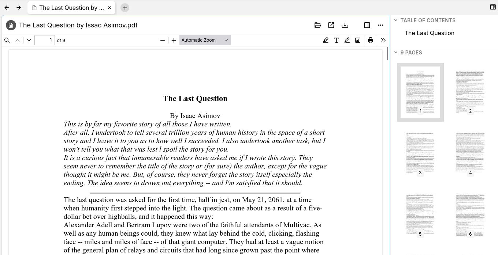

# PDFs
<figure class="image image_resized" style="width:74.34%;"></figure>

PDFs file can be uploaded in Trilium, where they will be displayed without the need to download them first.

Since v0.102.0, PDFs will be rendered using Trilium's built-in PDF viewer, which is a customization of [Mozilla's PDF.js viewer](https://mozilla.github.io/pdf.js/) (also built-in in the Mozilla Firefox browser). Versions prior to that render PDFs using the browser's default PDF viewer.

## Features

*   The last page viewed and scroll position is maintained in between restarts or note navigations.
*   Annotations (text, highlights) as well as comments. These are saved automatically.
*   Forms can be filled.
*   Can be printed or downloaded.
*   Can be saved as a [template](../../Advanced%20Usage/Templates.md) and the content of the PDF will be copied over to the new note. This is especially useful in combination with annotations or filled forms.
*   Integrates with the sidebar in the <a class="reference-link" href="../../Basic%20Concepts%20and%20Features/UI%20Elements/New%20Layout.md">New Layout</a>, by displaying the list of pages with thumbnails, table of contents and a listing of the annotations.

## Storing last position and settings

For every PDF, Trilium will remember the following information:

*   The current page.
*   The scroll position, within the current page.
*   The rotation of the page.

This makes it useful when reading large documents since the position is remembered automatically. This happens in the background, however it's recorded only a few seconds after stopping any scroll actions.

> [!TIP]
> Technically, the information about the scroll position and rotation is stored in the <a class="reference-link" href="../../Basic%20Concepts%20and%20Features/Notes/Attachments.md">Attachments</a> section, in a dedicated attachment called `pdfHistory.json`.

## Annotations

Since v0.102.0 it's possible to annotate PDFs. To do so, look for the annotation buttons on the right side of the PDF toolbar ().

Since v0.103.0:

*   Annotations are disabled if the note is marked as <a class="reference-link" href="../../Basic%20Concepts%20and%20Features/Notes/Read-Only%20Notes.md">Read-Only Notes</a>.
*   Comments can also be added, which is similar to highlights but also attach a text.
*   The <a class="reference-link" href="../../Basic%20Concepts%20and%20Features/UI%20Elements/Right%20Sidebar.md">Right Sidebar</a> also displays a list of annotations (highlights, comments), but only in the <a class="reference-link" href="../../Basic%20Concepts%20and%20Features/UI%20Elements/New%20Layout.md">New Layout</a>.

### Supported annotations

The following annotation methods are supported:

*   **Highlight**  
    Allows highlighting text with one of the predefined colors.
    *   The thickness is also adjustable.
    *   It's also possible to highlight the blank space, turning the feature more into a thicker pen.
*   **Text**  
    Allows adding arbitrary text, with a custom color and size.
*   **Pen**  
    Allows free drawing on the document, with variable color, thickness and opacity.
*   **Image**  
    Allows inserting images from outside Trilium directly into the document.

### Editing existing annotations

Although annotations are stored in the PDF itself, they can be edited. To edit an annotation, press one of the annotation buttons from the previous section to enter edit mode and click on an existing annotation. This will reveal a toolbar with options to customize the annotation (e.g. to change a color), as well as the possibility to remove it.

### How are annotations stored

Annotations are stored directly in the PDF. When modifications are made, Trilium will replace the PDF with the new one.

Since modifications are automatically saved, there's no need to manually save the document after making modifications to the annotations.

The benefit of “baked-in annotations” is that they are also accessible if downloading (for external use outside Trilium) or sharing the note.

The downside is that the entire PDF needs to be sent back to the server, which can slow down performance for larger documents. If you encounter any issues from this system, feel free to [report it](../../Troubleshooting/Reporting%20issues.md).

## Filling out forms

Similar to annotations, forms are also supported by Trilium since v0.102.0. If the document has fields that can be filled-in, they will be indicated with a colored background.

Simply type text in the forms and they will be automatically saved.

## Sidebar navigation

> [!NOTE]
> This feature is only available if <a class="reference-link" href="../../Basic%20Concepts%20and%20Features/UI%20Elements/New%20Layout.md">New Layout</a> is enabled. If you are using the old layout, these features are still available by looking for a sidebar button in the PDF viewer toolbar.

When a PDF file is opened in Trilium the <a class="reference-link" href="../../Basic%20Concepts%20and%20Features/UI%20Elements/Right%20Sidebar.md">Right Sidebar</a> is augmented with PDF-specific navigation, with the following features:

*   Table of contents/outline
    *   All the headings and “bookmarks” will be displayed hierarchially.
    *   The heading on the current page is also highlighted (note that it can be slightly offset depending on how many headings are on the same page).
    *   Clicking on a heading will jump to the corresponding position in the PDF.
*   Pages
    *   A preview of all the pages with a small thumbnail.
    *   Clicking on a page will automatically navigate to that page.
*   Annotations
    *   Highlight and comment annotations are listed here.
    *   For the old layout, this feature is not directly available, however there is a listing of comments directly in the PDF toolbar.
*   Attachments
    *   If the PDF has its own attachments (not to be confused with Trilium's <a class="reference-link" href="../../Basic%20Concepts%20and%20Features/Notes/Attachments.md">Attachments</a>), they will be displayed in a list.
    *   Some information such as the name and size of the attachment are displayed.
    *   It's possible to download the attachment by clicking on the download button.
*   Layers
    *   A less common feature, if the PDF has toggle-able layers, these layers will be displayed in a list here.
    *   It's possible to toggle the visibility for each individual layer.

## Share functionality

PDFs can also be shared using the <a class="reference-link" href="../../Advanced%20Usage/Sharing.md">Sharing</a> feature. This will also use Trilium's customized PDF viewer.

If you are using a reverse proxy on your server with strict access limitations for the share functionality, make sure that `[host].com/pdfjs` directory is accessible. Note that this directory is outside the `/share` route as it's common with the rest of the application.