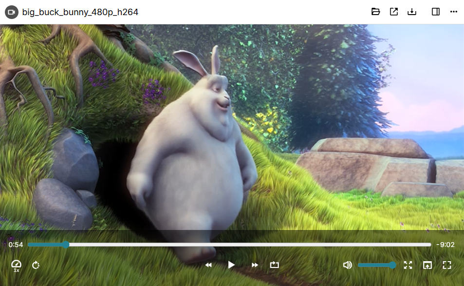

# Videos
<figure class="image image-style-align-right image_resized" style="width:61.8%;"></figure>

Starting with v0.103.0, Trilium has a custom video player which offers more features than the built-in video player.

Versions prior to v0.103.0 also support videos, but using the built-in player.

The file is streamed directly, so when accessing the note from a server it doesn't have to download the entire video to start playing it.

## Note on large video files

Although Trilium offers support for videos, it is generally not meant to be used with very large files. Uploading large videos will cause the <a class="reference-link" href="../../Advanced%20Usage/Database.md">Database</a> to balloon as well as the any <a class="reference-link" href="../../Installation%20%26%20Setup/Backup.md">Backup</a> of it. In addition to that, there might be slowdowns when first uploading the files. Otherwise, a large database should not impact the general performance of Trilium significantly.

## Supported formats

Trilium uses the built-in video decoding mechanism of the browser (or Electron/Chromium when running on the desktop). Starting with v0.103.0, a message will be displayed instead when a video format is not supported.

## Interactions

To play/pause the video, simply click anywhere on the video.

The controls at the bottom will hide automatically after playing, simply move the mouse to show them again.

The bottom bar has the following features:

*   A track bar to seek across the video.
*   On the left of the track bar, the current time is indicated.
*   On the right of the track bar, the remaining time is indicated.
*   On the left side there are buttons to:
    
    *   Adjust the playback speed (e.g. 0.5x, 1x).
    *   Rotate the video by 90 degrees.
*   In the center:
    
    *   Go back by 10s
    *   Play/pause
    *   Go forward by 30s
    *   Loop, which when enabled will restart the video once it reaches the end.
*   On the right side:
    
    *   Mute button
    *   Volume adjustment
    *   Full screen
    *   Zoom to fill, which will crop the video so that it fills the entire window.
    *   Picture-in-picture (if the browser supports it).

## Keyboard shortcuts

The following keyboard shortcuts are supported by the video player:

|  |  |
| --- | --- |
| <kbd>Space</kbd> | Play/pause |
| <kbd>Left arrow key</kbd> | Go back by 10s |
| <kbd>Right arrow key</kbd> | Go forward by 10s |
| <kbd>Ctrl</kbd> + <kbd>Left arrow key</kbd> | Go back by 1 min |
| <kbd>Ctrl</kbd> + <kbd>Right arrow key</kbd> | Go right by 1 min |
| <kbd>F</kbd> | Toggle full-screen |
| <kbd>M</kbd> | Mute/unmute |
| <kbd>Home</kbd> | Go to the beginning of the video |
| <kbd>End</kbd> | Go to the end of the video |
| <kbd>Up</kbd> | Increase volume by 5% |
| <kbd>Down</kbd> | Decrease volume by 5% |