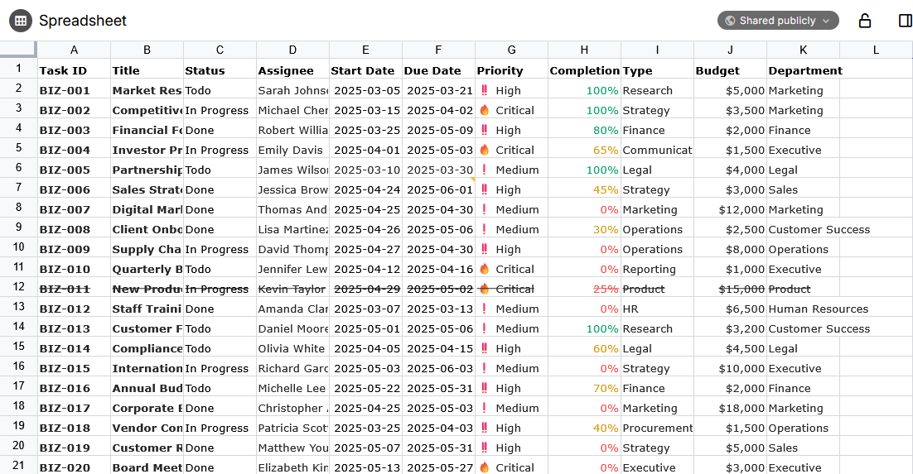

# Spreadsheets
<figure class="image"></figure>

> [!IMPORTANT]
> Spreadsheets are a new type of note introduced in v0.103.0 and are currently considered experimental/beta. As such, expect major changes to occur to this note type.

Spreadsheets provide a familiar experience to Microsoft Excel or LibreOffice Calc, with support for formulas, data validation and text formatting.

## Spreadsheets vs. collections

There is a slight overlap between spreadsheets and the <a class="reference-link" href="../Collections/Table.md">Table</a> collection. In general the table collection is useful to track meta-information about notes (for example a collection of people and their birthdays), whereas spreadsheets are quite useful for calculations since they support formulas.

Spreadsheets also benefit from a wider range of features such as data validation, formatting and can work on a relatively large dataset.

## Important statement regarding data format

For Trilium as a knowledge database, it is important that data is stored in a format that is easy to convert to something else. For example, <a class="reference-link" href="Text.md">Text</a> notes can be exported to either HTML or Markdown, making it relatively easy to migrate to another software or simply to stand the test of time.

For spreadsheets, Trilium uses a technology called [Univer Sheets](https://docs.univer.ai/), developed by DreamNum Co., Ltd. Although this software library is quite powerful and has a good track record (starting with Luckysheet from 2020, becoming Univer somewhere in 2023), it uses its own JSON format to store the sheets.

As such, if Univer were to become unmaintained or incompatible for some reason, your data might become vendor locked-in.

With that in mind, spreadsheets can be really useful for quick calculations, but it's important not to have critical information on it that you might not want to need in a few years time.

## Regarding data export

Currently, in Trilium there is no way to export the spreadsheets to CSV or Excel formats. We might manage to add support for it at some point, but currently this is not the case.

## Supported features

The spreadsheet has support for the following features:

*   Filtering
*   Sorting
*   Data validation
*   Conditional formatting
*   Notes / annotations
*   Find / replace

We might consider adding [other features](https://docs.univer.ai/guides/sheets/features/filter) from Univer at some point. If there is a particular feature that can be added easily, it can be discussed over [GitHub Issues](../Troubleshooting/Reporting%20issues.md).

## Features not supported yet

### Regarding Pro features

Univer spreadsheets also feature a [Pro plan](https://univer.ai/pro) which adds quite a lot of functionality such as charts, printing, pivot tables, export, etc.

As the Pro plan needs a license, Trilium does not support any of the premium features. Theoretically, pro features can be used in trial mode with some limitations, we might explore this direction at some point.

### Planned features

There are a few features that are already planned but are not supported yet:

*   Trilium-specific formulas (e.g. to obtain the title of a note).
*   User-defined formulas
*   Cross-workbook calculation

If you would like us to work on these features, consider [supporting us](https://triliumnotes.org/en/support-us).

## Known limitations

*   It is possible to share a spreadsheet, case in which a best-effort HTML rendering of the spreadsheet is done.
    *   For more advanced use cases, this will most likely not work as intended. Feel free to [report issues](../Troubleshooting/Reporting%20issues.md), but keep in mind that we might not be able to have a complete feature parity with all the features of Univer.
*   There is currently no export functionality, as stated previously.
*   There is no dedicated mobile support. Mobile support is currently experimental in Univer and when it becomes stable, we could potentially integrate it into Trilium as well.