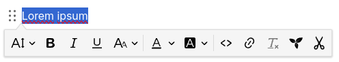
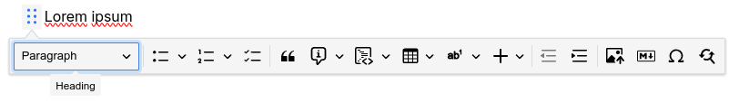
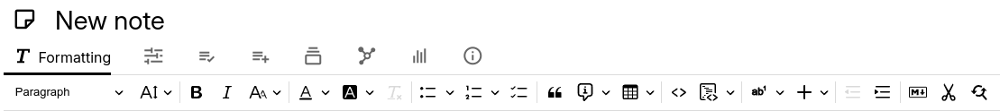

# Text
The default note type in Trilium, text notes allow for rich formatting, tables, images, admonitions and a handful of other features.

## Formatting bars

Most of the interaction with text notes is done via the built-in toolbars. Depending on preference, there are two different layouts:

*   The _Floating toolbar_ is hidden by default and only appears when needed. In this mode there are actually two different toolbars:  
    
*   A toolbar that appears when text is selected. This provides text-level formatting such as bold, italic, text colors, inline code, etc.  
    __

Fore more information see <a class="reference-link" href="Text/Formatting%20toolbar.md">Formatting toolbar</a>.

## Features and formatting

Here's a list of various features supported by text notes:

<table><thead><tr><th>Dedicated article</th><th>Feature</th></tr></thead><tbody><tr><td><a class="reference-link" href="Text/General%20formatting.md">General formatting</a></td><td><ul><li data-list-item-id="e04c84d59d44645ee89b2a8541ed99f90">Headings (section titles, paragraph)</li><li data-list-item-id="e39d25bd3d8bd06185b9d259e5827d451">Font size</li><li data-list-item-id="e1f7e2a2f4b03449d82bdf5b5c6ea8d44">Bold, italic, underline, strike-through</li><li data-list-item-id="e3decae72884f65b4d538151b6a297072">Superscript, subscript</li><li data-list-item-id="e59adf00fef65304c163ae190fac5e92a">Font color &amp; background color</li><li data-list-item-id="ed3f09156147a2769e91db111c76376e2">Remove formatting</li></ul></td></tr><tr><td><a class="reference-link" href="Text/Lists.md">Lists</a></td><td><ul><li data-list-item-id="ee87806a913900d85d8f018af81f41df8">Bulleted lists</li><li data-list-item-id="e3ae314e365fa418ca6e0f061d63834c5">Numbered lists</li><li data-list-item-id="ee84e08694165f95430046cb34f4cd123">To-do lists</li></ul></td></tr><tr><td><a class="reference-link" href="Text/Block%20quotes%20%26%20admonitions.md">Block quotes &amp; admonitions</a></td><td><ul><li data-list-item-id="e2892dc35a0d4b7ad65daffb8f9404daa">Block quotes</li><li data-list-item-id="e7297e3ad1002f8de15aa0bd66c6f3f22">Admonitions</li></ul></td></tr><tr><td><a class="reference-link" href="Text/Tables.md">Tables</a></td><td><ul><li data-list-item-id="eb358a4567d93f66004f4195df2dda05a">Basic tables</li><li data-list-item-id="e6135a555d6c63c30e4b84806a4870830">Merging cells</li><li data-list-item-id="e29ac76563d0998b28fb1baf94dbdac8c">Styling tables and cells.</li><li data-list-item-id="e372446e81fdedada64b8bed89ca93d1a">Table captions</li></ul></td></tr><tr><td><a class="reference-link" href="Text/Developer-specific%20formatting.md">Developer-specific formatting</a></td><td><ul><li data-list-item-id="eb260b76afcbc07bd9d4ceec4e000e8a0">Inline code</li><li data-list-item-id="e9864352286369ebe7b41c1599f498de8">Code blocks</li><li data-list-item-id="ee62fb9ed7f349178e8f2a2bd9ec8cd74">Keyboard shortcuts</li></ul></td></tr><tr><td><a class="reference-link" href="Text/Footnotes.md">Footnotes</a></td><td><ul><li data-list-item-id="edf62ec004eff35cfcb7e361deef19aaf">Footnotes</li></ul></td></tr><tr><td><a class="reference-link" href="Text/Images.md">Images</a></td><td><ul><li data-list-item-id="ebe6277e643041403489c3ceb30c36f7f">Images</li></ul></td></tr><tr><td><a class="reference-link" href="Text/Links.md">Links</a></td><td><ul><li data-list-item-id="e3f988be2f259bb40607cb61541955395">External links</li><li data-list-item-id="e3f91cc4f0cccd2c077cc306bacd68ef2">Internal Trilium links</li></ul></td></tr><tr><td><a class="reference-link" href="Text/Include%20Note.md">Include Note</a></td><td><ul><li data-list-item-id="eac8015a64bce7b749cc67d1599062007">Include note</li></ul></td></tr><tr><td><a class="reference-link" href="Text/Insert%20buttons.md">Insert buttons</a></td><td><ul><li data-list-item-id="e5cdf5d3885ec0ea67f924b4b8fe5c483">Symbols</li><li data-list-item-id="e95082e6642ed5b1eec6e4e116b899a40"><a class="reference-link" href="Text/Math%20Equations.md">Math Equations</a></li><li data-list-item-id="ecbef6a358a5b8d27f0d3e08bbc750aa9">Mermaid diagrams</li><li data-list-item-id="e6e97ee14dd29b7ccf53227107e5dc72d">Horizontal ruler</li><li data-list-item-id="e6198c7c535c249faec2e8906775f11de">Page break</li></ul></td></tr><tr><td><a class="reference-link" href="Text/Other%20features.md">Other features</a></td><td><ul><li data-list-item-id="e0c14456cb83d483b07ea432ef9d4728e">Indentation<ul><li data-list-item-id="e2029812c5e105c595590f70ee227631e">Markdown import</li></ul></li><li data-list-item-id="ea1ee012286e05190c89c9f4e64cf2036"><a class="reference-link" href="Text/Cut%20to%20subnote.md">Cut to subnote</a></li></ul></td></tr><tr><td><a class="reference-link" href="Text/Premium%20features.md">Premium features</a></td><td><ul><li data-list-item-id="e1ab173193a533ccf33dccfd0cb916f1f"><a class="reference-link" href="Text/Premium%20features/Slash%20Commands.md">Slash Commands</a></li><li data-list-item-id="e564b978c09fe5adf476b331b1e0640e3"><a class="reference-link" href="../Advanced%20Usage/Templates.md">Templates</a></li><li data-list-item-id="e756306c31d9beffbba3820b6d1b9bc61"><a class="reference-link" href="Text/Premium%20features/Format%20Painter.md">Format Painter</a></li></ul></td></tr></tbody></table>

## Read-Only vs. Editing Mode

Text notes are usually opened in edit mode. However, they may open in read-only mode if the note is too big or the note is explicitly marked as read-only. For more information, see <a class="reference-link" href="../Basic%20Concepts%20and%20Features/Notes/Read-Only%20Notes.md">Read-Only Notes</a>.

## Keyboard shortcuts

There are numerous keyboard shortcuts to format the text without having to use the mouse. For a reference of all the key combinations, see <a class="reference-link" href="../Basic%20Concepts%20and%20Features/Keyboard%20Shortcuts.md">Keyboard Shortcuts</a>. In addition, see <a class="reference-link" href="Text/Markdown-like%20formatting.md">Markdown-like formatting</a> as an alternative to the keyboard shortcuts.

## Content width

For readability purposes on wider screens, the width of text notes is limited via a configurable option. See <a class="reference-link" href="../Basic%20Concepts%20and%20Features/UI%20Elements/Content%20width.md">Content width</a> for more information.

## Technical details

For the text editing functionality, Trilium uses a commercial product (with an open-source base) called <a class="reference-link" href="../Advanced%20Usage/Technologies%20used/CKEditor.md">CKEditor</a>. This brings the benefit of having a powerful WYSIWYG (What You See Is What You Get) editor.